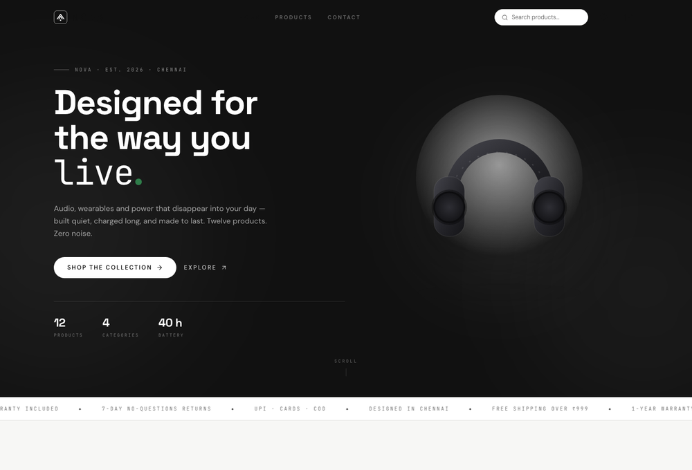
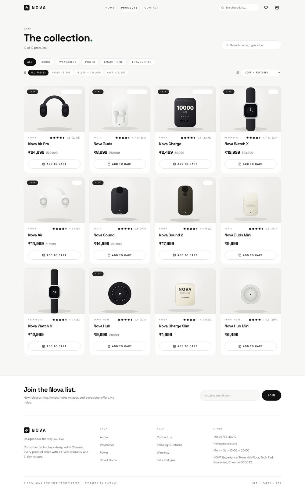
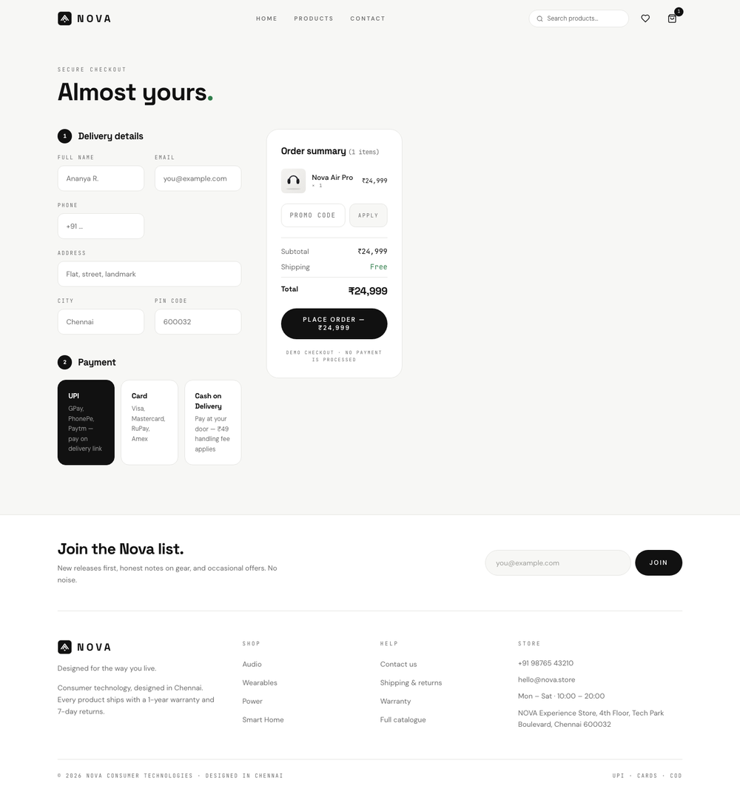
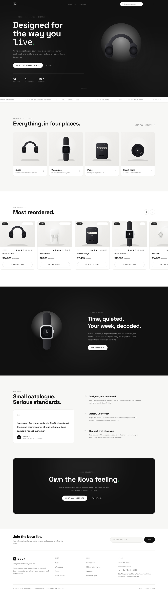

<div align="center">



# NOVA

**A premium consumer-electronics storefront** — audio, wearables, power and smart home, designed in Chennai.

[](https://nextjs.org/)
[](https://react.dev/)
[](https://www.typescriptlang.org/)
[](https://tailwindcss.com/)
[](https://www.framer.com/motion/)
[](LICENSE)

</div>

Monochrome design system, studio-style SVG product renders, INR pricing. Frontend-only: no database, no API, no admin panel.

## Contents

- [Run locally](#run-locally)
- [Pages](#pages)
- [Features](#features)
- [Screenshots](#screenshots)
- [Project structure](#project-structure)
- [Customisation](#customisation)
- [Deploy on EC2](#deploy-on-ec2-ubuntu-2204-node-20)
- [Notes](#notes)
- [License](#license)

## Run locally

```bash
npm install
npm run dev        # http://localhost:3000
```

Production:

```bash
npm run build
npm start
```

## Pages

| Route       | Description                                                                       |
| ----------- | ---------------------------------------------------------------------------------- |
| `/`         | Home — parallax hero, marquee, category tiles, carousel, feature band, editorial   |
| `/products` | Catalogue — search, category chips, price bands, sort, favourites filter           |
| `/contact`  | Contact form (frontend-only success state) + store info                            |
| `/checkout` | Checkout — details, payment selection, promo `NOVA10`, inline order confirmation   |
| `/*`        | 404 page                                                                            |

No `/order-success` page — order confirmation happens inline on `/checkout`. Cart is a slide-in drawer (no cart page). `/products` accepts `?q=`, `?category=`, `?wishlist=1` URL presets.

## Features

- **Cart & wishlist** persisted in `localStorage` (`nova-cart`, `nova-wishlist`), hydrating after mount — no SSR reads, no hydration mismatch.
- **Cart drawer**: spring slide-in with overlay, quantity controls, per-line totals, free shipping over ₹999, live subtotal/shipping.
- **Checkout**: UPI / Card / COD selection, promo code `NOVA10` (5% off), generates an order id (`NOVA-XXXXXX`), clears the cart, shows inline confirmation with copyable order id.
- **Home animations**: mouse-parallax + float hero render, scroll-linked parallax feature band, marquee ticker, stagger/scroll reveals, horizontal snap carousel. Respects `prefers-reduced-motion`.

## Screenshots

<table>
<tr>
<td width="50%">

**Catalogue** — search, filters, sort



</td>
<td width="50%">

**Checkout** — delivery, payment, order summary



</td>
</tr>
</table>

<details>
<summary><strong>Full home page</strong> (click to expand)</summary>
<br>

</details>

## Project structure

```
nova/
├── public/
│   ├── logo.svg                 # wordmark mark
│   └── products/*.svg           # 12 studio product renders (transparent bg + halo)
├── docs/
│   └── screenshots/             # README images
├── src/
│   ├── StoreContext.tsx         # cart + wishlist state, localStorage, drawer
│   ├── data.ts                  # products, categories, store info, INR formatter
│   ├── app/
│   │   ├── layout.tsx           # fonts, metadata, StoreProvider, Navbar, Footer
│   │   ├── globals.css          # design tokens (Tailwind @theme)
│   │   ├── page.tsx / Home.tsx  # home
│   │   ├── products/            # catalogue (Products.tsx = client UI)
│   │   ├── contact/
│   │   ├── checkout/
│   │   └── not-found.tsx
│   └── components/
│       ├── Navbar.tsx           # nav, search, cart badge, mobile menu, CartDrawer
│       ├── Footer.tsx           # newsletter, links, store info
│       ├── ProductCard.tsx      # hover art zoom, badges, ratings, wishlist, add-to-cart
│       ├── CartDrawer.tsx
│       └── ui.tsx               # Button, SectionLabel, Rating, pills
├── next.config.ts
├── tsconfig.json
├── postcss.config.mjs
└── package.json
```

## Customisation

- **Products / prices / store info**: edit `src/data.ts` — everything (cards, drawer, checkout, footer, filters) reads from it.
- **Product art**: drop SVGs into `public/products/<id>.svg`; transparent background with a soft halo renders best on both light and dark bands.
- **Design tokens**: edit `@theme` in `src/app/globals.css` (`bg`, `surface`, `ink`, `muted`, `line`, `accent`, `success`, `danger`).
- **Fonts**: DM Sans / Space Grotesk / JetBrains Mono, swapped in `src/app/layout.tsx`.

## Deploy on EC2 (Ubuntu 22.04, Node 20)

```bash
# on the server
sudo apt update && sudo apt install -y nginx curl
curl -fsSL https://deb.nodesource.com/setup_20.x | sudo -E bash - && sudo apt install -y nodejs

# push the project, then
npm ci && npm run build

# process manager
npm i -g pm2
pm2 start "npm start" --name nova
pm2 save && pm2 startup

# nginx reverse proxy
sudo tee /etc/nginx/sites-available/nova << 'EOF'
server {
  listen 80;
  server_name _;

  location / {
    proxy_pass http://127.0.0.1:3000;
    proxy_http_version 1.1;
    proxy_set_header Upgrade $http_upgrade;
    proxy_set_header Connection "upgrade";
    proxy_set_header Host $host;
  }
}
EOF
sudo ln -s /etc/nginx/sites-available/nova /etc/nginx/sites-enabled/
sudo nginx -t && sudo systemctl reload nginx
```

Point the instance's public IP at the server. For HTTPS, add a domain + `certbot --nginx`.

## Notes

- All prices in INR (`en-IN` locale). Demo site — checkout does not process payments.
- No environment variables required.

## License

MIT © [eashan4](https://github.com/Eashan4) — see [LICENSE](LICENSE) for details.
